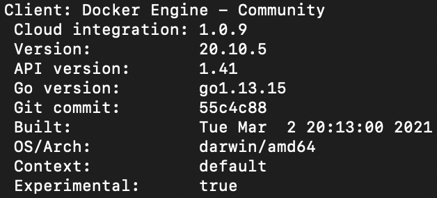
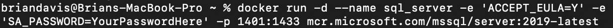
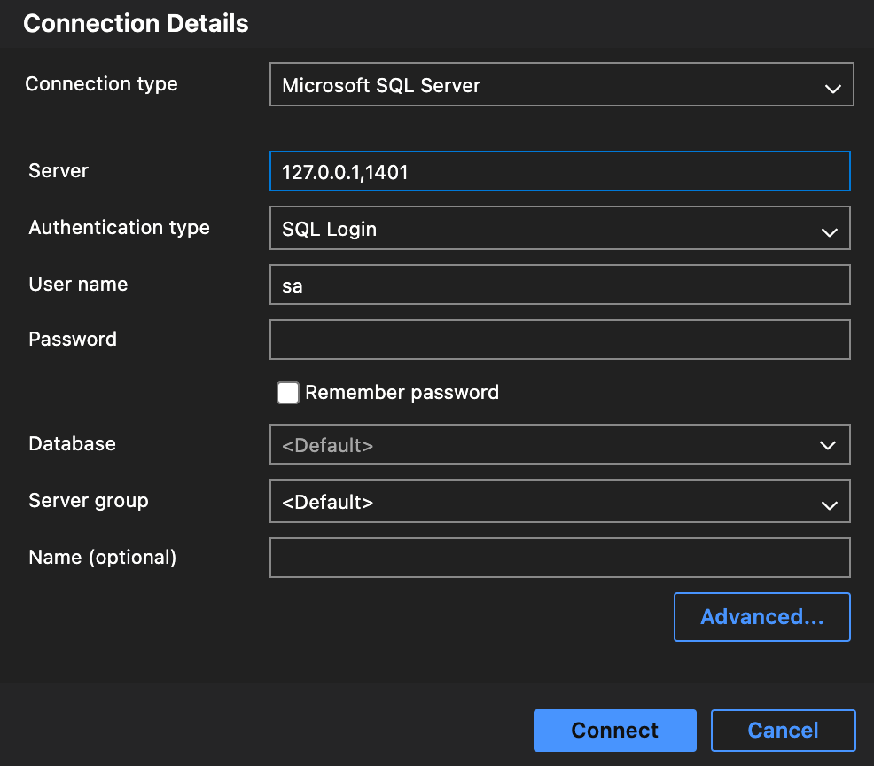
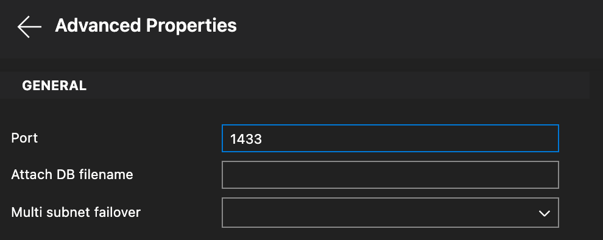
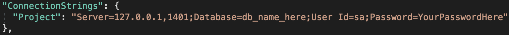

# Run MS SQL Server on MacOS

Follow these instructions to run Microsoft SQL Server on a Mac!

## Download Docker Desktop for Mac

https://docs.docker.com/docker-for-mac/install/

Make sure that you have the Docker cli installed.
 
Type "docker version" in the command line into the terminal to check.
 
It should look like this:

 
## Install the Linux Version of SQL Server

Replace Username with your Username and TypeYourPassword with your password:

Then install the sql cli:

## Download and install Azure Data Studio for Mac

https://docs.microsoft.com/en-us/sql/azure-data-studio/download-azure-data-studio

Then log in using the username and password you set when you downloaded SQL Server:

Click on Advanced Properties and enter the port you created (1433): 

## Formatting Connection Strings in Visual Studio

